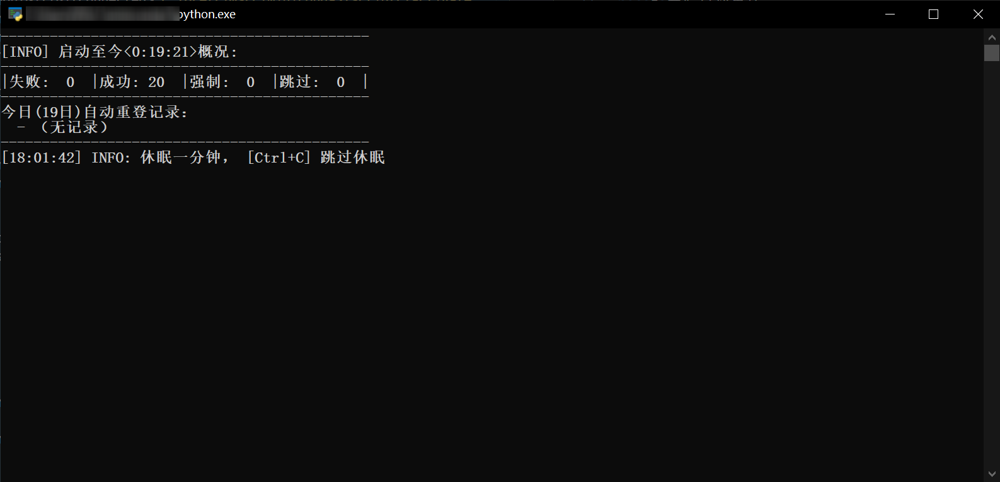

<p align="center">
  
</p>

# 校园网脚本食用方法

校园网(BIT-Web) 自动重连 Windows 解决方案，应用场景：远程桌面自动重连，开机自启动（自登录）

## 使用步骤

1. 安装[python](https://www.python.org/downloads/)：

2. 去[release](https://github.com/KJH-x/BIT-Connect/releases/)下载[`Campus_network.7z(v1.2.0)`](https://github.com/KJH-x/BIT-Connect/releases/download/v1.2.0/BitConnected.7z)并解压或者`git clone`

3. 安装python依赖（在解压后的文件夹地址栏输入cmd，复制以下内容粘贴运行）

    > ```batch
    > pip install -r requirements.txt
    > ```

4. 运行脚本
    - 开始自动重连：
        1. 双击运行BITConnect_tray.pyw
        2. 按照提示输入账号密码，请确保正确，可以在登出的情况下运行以确保登录信息有效
        3. 挂机
        4. 通过在任务栏托盘处找到图标，右键切换控制台现实情况
    - 只想用来登录、登出（命令行）
        1. `python AIO_login.py -a 登录`（或‘登出’）
        2. 按照提示输入账号密码

5. 添加到计划任务

```powershell
$executable_path="脚本完整路径"

Register-ScheduledTask -Action (New-ScheduledTaskAction -Execute $executable_path) -Trigger (New-ScheduledTaskTrigger -AtLogon) -Settings (New-ScheduledTaskSettingsSet -NetworkId "BIT-web" -AllowStartIfOnBatteries -DontStopIfGoingOnBatteries -StartWhenAvailable -MultipleInstances IgnoreNew -DontStopOnIdleEnd -ExecutionTimeLimit 0) -Principal (New-ScheduledTaskPrincipal -UserId $Env:UserName -LogonType Interactive) -TaskName "BIT-Connect" -Description "BIT-Web 的自动重连"
```

## 运行截图



## 冷知识

1. 参数：
    - AIO的启动参数暂时只有-a/--action
    - 这个参数可选字段有`login`, `登录`, `登陆`, `上线`, `logout`, `登出`, `下线`, `退出`
2. 脚本故事
    - 本脚本依据模组10_0_0_55版本混合改编（2022），其最新版名称是[bitsrun](https://github.com/BITNP/bitsrun)
    - ...
    - 而10_0_0_55模组的祖先是[Aloxaf](https://github.com/Aloxaf/10_0_0_55_login)
    - 一开始我写这个是为了自己和几位朋友用
    - 在2022下半年测试时发现校园网下ping百度失败的概率比ping哔哩哔哩的失败概率高，故此脚本选择了后者
3. 安全
    - 密码是在本地明文储存的`./BITer.json`
    - 由`./AIO-login.py`在初次使用时创建（或在密码错误等情况下修改）
    - 你可以随时删除，并在下一次登陆的时候重新输入账号密码
    - 注意，自动重连依赖于账号密码的保存

4. macos/linux的请使用bitsrun，不支持
5. 欢迎Issue可能的bug
6. 感谢 `pystray` 思路
7. ...
8. 本代码参加了北京理工大学第一届“十行代码”挑战赛

## 什么，你还需要IPv6？

下载/ipv6_tools的两个脚本，将`重启v6.v1.2.1.ps1`拖拽到`runwith.UAC_pwsh.bat`(没错，是拖拽而不是其他打开方法)
然后跟随脚本指示排除问题，如果有进一步问题请+咨询群询问。
